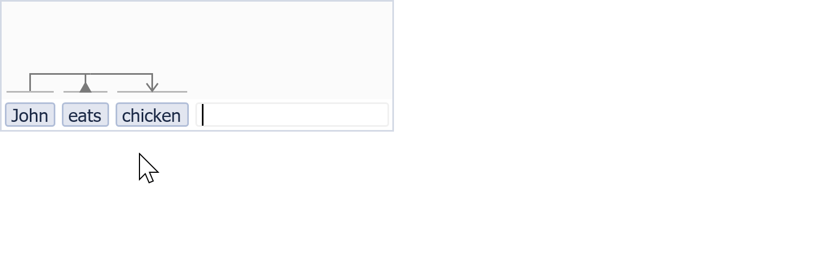
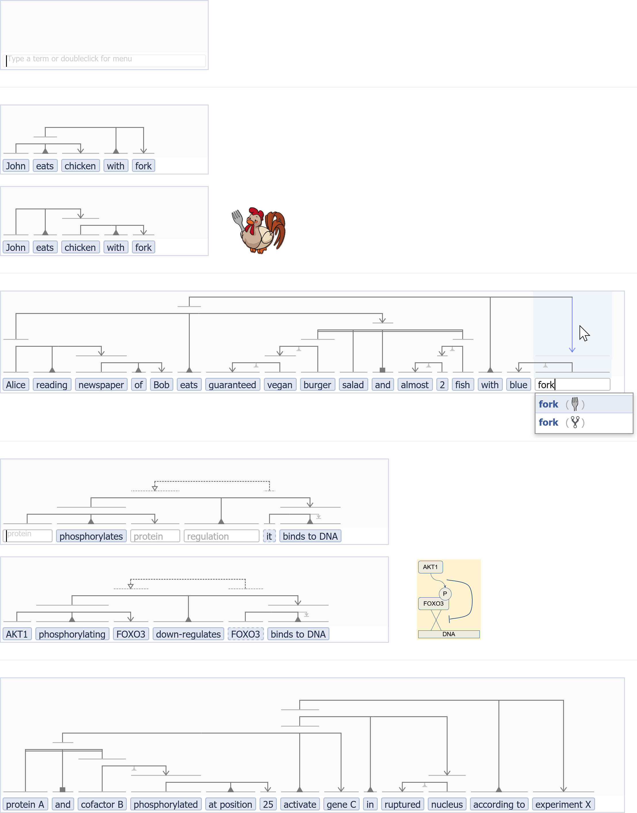

# vsm-box

<br>

## Intro

`vsm-box` is a web-component for entering or showing a VSM-sentence.

A **VSM-sentence** is a computer-understandable, natural-looking statement,
where each term is linked to an ID, and terms are organized with VSM-connectors.

**VSM** (Visual Syntax Method) is an intuitive method to translate any
knowledge, no matter its type or complexity, into an elegant form that is
understandable by both humans and computers. - A full description of this
general-purpose method for structuring information into a computable form,
is available on [scicura.org/vsm](http://scicura.org/vsm).

A **web-component** is something that can be shown in a web page by simply
inserting an HTML-tag, like a `<button>`, `<input>`, or here a `<vsm-box>`.

See:
- a concise intro on [vsmjs.github.io](http://vsmjs.github.io),
  on how to use a vsm-box in your web-app;
- a larger introduction on this
  [poster](https://f1000research.com/posters/8-442);
- a [**live vsm-box**](http://scicura.org/vsm-box) to interact with;
- many explained [VSM examples](http://scicura.org/vsm/examples.html)
  (using an earlier vsm-box prototype);
- this **vsm-box animation** (what you see is: 1. entering two terms, 2.
  checking one term's definition (by mousehovering), 3. adding a connector
  that creates an unintended meaning ('chicken with fork') (+ see that
  connectors are automatically reordered for optimal layout), 4. removing
  it, 5. adding the second connector correctly) :

<style>img[alt$="-600w"] { width: 600px; display: block; }</style>



- **vsm-box examples** (screenshots + information):

<br>



<br>

<br>`vsm-box` is small on the outside (when empty), and large on the inside
(in features):  
&nbsp;&bull; For people who use a vsm-box to curate (collect & structure)
information, it looks compact and elegant,
especially when just filling in VSM-templates.  
&nbsp;&bull; For web-developers who embed a vsm-box in some web application,
it has lots of **customization** possibilities,
to support the needs of various user groups.

<br>

## VSM-sentence data model

A VSM-sentence is represented as an Object with a `terms` and a `conns` property,
which represent VSM-terms and VSM-connectors respectively:  
`{ terms:.., conns:.. }`

<br>

### VSM-term data model

There are several types of VSM-terms. Each one is represented by an Object
with certain properties, from which its type can be inferred.  

For example, the most common type is an 'Instance'-term, which may look like:  
`{ str:.., style:.., descr:.., dictID:.., classID:.., instID:.. }`  

These are all the VSM-term types:

| Type               | Required properties               | Optional properties           | Optional, template-related properties                    |
|--------------------|-----------------------------------|-------------------------------|----------------------------------------------------------|
| Literal            | str                               | isFocal, style                | minWidth, maxWidth, editWidth, queryOptions, placeholder |
| Class              | str, classID                      | isFocal, style, dictID, descr | minWidth, maxWidth, editWidth, queryOptions, placeholder |
| Instance           | str, classID, instID              | isFocal, style, dictID, descr | minWidth, maxWidth, editWidth, queryOptions, placeholder |
| Referring instance | str, classID, instID, parentID    | isFocal, style, dictID, descr | minWidth, maxWidth, editWidth, queryOptions, placeholder |
| Edit-Instance      | (none)                            | isFocal                       | minWidth, maxWidth, editWidth, queryOptions, placeholder |
| Edit-Class         | type `: 'EC'`                     | isFocal                       | minWidth, maxWidth, editWidth, queryOptions, placeholder |
| Edit-Literal       | type `: 'EL'`                     | isFocal                       | minWidth, maxWidth, editWidth, queryOptions, placeholder |
| Edit-Referring*    | type `: 'ER'`                     | isFocal                       | minWidth, maxWidth, editWidth, queryOptions, placeholder |

Notes:
+ About `classID`, for **Instance** and **Class** terms (_for Referring Terms,
  see later_):
  + The `classID` of a VSM-term corresponds to the `id` of an entry from a
    VSM-dictionary.
  + In a setup that allows users to create new a concept/class on-the-fly,
    i.e. before that class is stored in a database, and thus before it has a
    stored & referable `classID`:  
    only in such a setup, such a term's `classID` may be `null`
    during VSM-sentence construction.
+ About `instID` (only for **Instance** and **Referring** terms):
  + An Instance/Referring term's `instID` is `null` (but not absent) in a
    VSM-sentence that has not been saved yet in some database.  
  + After it has been saved, the database should provide the `instID` it
    created for each VSM-term.  
  + A VSM-term's `instID` can then be used to refer to it as a parent term,
    also from other VSM-sentences.
  + Note on `instID` conservation:
    when a user edits an already-stored VSM-sentence, and changes a term's type
    from Inst. to Ref. or vice versa (i.e. without replacing it with a new term
    via autocomplete), then the vsm-box reports the term with the same `instID`
    (only its `parentID` and maybe `classID` would change).
+ About both `parentID` and `classID`, for **Referring** terms:
  + They are both `null` (but not absent) until the Referring term has been
    connected to a 'parent term'.  
    I.e. they are `null` during VSM-sentence construction, as long as the term
    is not connected to a parent term through the presence of a
    reference-connector,
    nor by it referring to the ID of some term in another VSM-sentence.
  + When it is connected to a parent term that was not stored yet (i.e. in the
    same, under-construction VSM-sentence), and so that parent still has a
    `null` `instID`, then the Referring term's `parentID` is `null` too.  
    In that case, its `classID` will be the same as its parent's `classID`.
  + When it is connected to a parent term that has been stored (and thus
    has a known `instID` and `classID`),  
    then the Referring term's `parentID` and `classID` are equal to its parent's
    `instID` and `classID` resp.
  + <span style="font-size: smaller"> (Implementation notes):  
    &bull; The above describes how a vsm-box's `classID` and `parentID` are
    presented to the outside world, i.e. the way it emits its current state.  
    &bull; Internally, however, an unconnected Referring term's `classID` may
    be not-`null`, e.g. if it was an Instance term before but it was changed to
    a Ref. term. Because then, if the user would decide to change it back to
    Inst. type, it can be restored with its original not-`null` `classID`.  
    &bull; Also, when a Referring term refers to a term in another (or same),
    stored VSM-sentence, then both its `parentID` (==external parent's `instID`)
    and its `classID` (==external parent's `classID`) will keep their non-`null`
    value, internally.
    This is kept so, internally, even if it is changed to or back from other
    term types, or if it would be connected and then unconnected by a
    Reference-connector to a different term, in the same sentence. But it is
    emitted correctly, according to its current type and connection state.  
    </span>
+ A single one of the VSM-terms in a VSM-sentence may have an `isFocal: true`
  property, to indicate that it is the sentence's head (= focal term).
+ The optional `style` property is used to apply custom styling to `str` (e.g.
  to stylize parts of `str` in superscript, in a charged ion's name);
  see [`string-style-html`](https://github.com/vsmjs/string-style-html).
+ A Class/Instance/Referring-term's properties `dictID` and `descr` are optional.
  They are used to make extra information about the VSM-term available, as soon
  as its VSM-sentence gets loaded into a new user-interface component.
+ The four Edit-type term types are empty fields that a user can fill in,
  to generate a meaning- or text-containing VSM-term.  
  The default type is Edit-Instance (or called Editable-Instance, or Edit-type).
  + The four Edit-type terms enable a user to enter or generate an
    Instance/Class/Literal/Referring-type VSM-term in its place, respectively.
  + The user can also switch any non-Edit-type term back to its Editable
    counterpart.
  + *: (An Edit-Referring-type term is likely not useful in a VsmBox's 
    `initialValue` prop, but exists so that the VsmBox can support the editing
    of Referring-type terms too).  
  + Edit-Instance and Edit-Class terms use a VsmAutocomplete component
    for term+ID lookup.  
    Edit-Literal and Edit-Referring terms, however, use a plain
    HTML-&lt;input&gt; field for input. Because:
    + Edit-Literal has no classID, it is just a plain text string.
    + Edit-Referring inherits its classID from its parent term, so the only
      part of it that may be edited, is its string label.  
      E.g. a user could replace a Referring term's label "it" by "the dog"
      for clarity, to create an easy-to-read VSM-sentence.
  + The 'endTerm' (see later) is an Edit-type term as well.
  + (Implementation note: internally, the Edit-Instance term gets an 'EI' `type`,
    and non-Edit terms get 'L'/'C'/'I'/'R' types resp. But for efficiency
    this does not need to given to VsmBox, nor is it emitted in `change` events).
+ `minWidth` and `maxWidth` define a term's content's minimum required and
  maximum allowed display-width, in pixels.
  `editWidth` is the width while it is being edited.
  + If a term has no `maxWidth` property, then `sizes.defaultMaxWidth` is used.  
  + Making a term's `maxWidth` 0 removes any limit.
  + If an Edit-type term has no `editWidth` property or it is 0, then
    `sizes.defaultEditWidth` is used.
  + These widths pertain to a term's string-content only. A term's total width
    will include its padding and border in addition.
  + An external CSS declaration could set a VsmBox's font-size to larger than
    the default font-size, and then the min/max/..Widths would accomodate less
    text than intended.  
    Therefore, `sizes.widthScale` controls scaling to adjust for a different
    font size.
    + For example, VsmBox's default font-size is currently 11px. If external CSS
      sets it to 22px, then min/max/edit/default...Width will accomodate half as
      much text. Then, by setting `sizes.widthScale` to 2, these widths will be
      scaled to twice as wide, and hold just as much text as in the 11px case.
    + + If `sizes.widthScale` is left to its default value of `false`, then it
        will be automatically calculated (replaced by a number) based on
        currently active `.term`-CSS.
      + If set to `1`, no scaling happens.
      + If set to a number different than `1`, that scale will be used instead
        of auto-scaling.
+ The `queryOptions` property is used by a VSM-term's autocomplete, when it
  sends a query to `VsmDictionary.getMatchesForString()`.  
  (See also [`vsm-dictionary`](https://github.com/vsmjs/vsm-dictionary)'s
  [`spec`](https://github.com/vsmjs/vsm-dictionary/blob/master/Dictionary.spec.md),
  in particular for `getEntryMatchesForString()` and `getMatchesForString()`).  
  Used with VSM-templates (see an example further below), this enables
  targeted term-lookup, customizable per Edit-type term.  
  These properties may also be stored in VSM-sentences that were built with a
  VSM-template, so that they can use the same query-options when being re-edited.  
  `queryOptions` accepts these optional sub-properties, as defined in
  vsm-dictionary:
  + `filter`: {Object}:
    + `dictID`: {Array(String)}:  
      a list of dictIDs. It returns only for these, combined in OR-mode.
  + `sort`: {Object}:
    + `dictID`: {Array(String)}:  
      sorts matches whose dictID is in this list, first; then sorts as usual.
      This enables defining 'preferred dictionaries'.
  + `fixedTerms`: {Array(Object)}:  
    a list of "fixedTerms", represented by a
    classID + optional term-string: `[{ id:.., str:.. },  ...]`.  
    + Note: fixedTerms appear on top of the VSM-term's autocomplete result list,
      and already appear when the term is focused and has no text input yet.  
    + Note!: everywhere else in the code and in other modules `fixedTerms` is
      still called (more obscurely) `idts`, but that will be changed there soon.
  + `z`: {true|Array(String)}:  
    determines to include a full, partial, or no z-object (via empty array).
  + `perPage` {int}:  
    how many matches should be queried from the VsmDictionary;
    i.e. the maximum number of items that should appear in the autocomplete
    result-list, excluding special items.
+ `placeholder`: the String that will be shown in a light color,
  in an empty Edit-type term, to suggest what kind of data the user is
  supposed to enter there. E.g. 'protein', or 'location'.  
  For a non-Edit-type term, this placeholder would be shown when the user
  converts it to Edit-type, and then clears the input-field's content.  
  This prop is used both by EI/EC-terms' VsmAutocomplete,
  and with ER/EL-terms' plain input-field.
+ Arbitrary extra properties can be set too, as long as they do not interfere
  with the inner workings of vsm-box.  
  Extra properties are kept (i.e. not removed), when received in the vsm-box's
  `initialValue`, and also when received by the Paste function, and when
  emitting the state of the vsm-box (see all further below). &ndash;
  Extra properties are stripped though, when data is sent out by the Copy
  function, or received as dictionary-data by autocomplete.  
  This supports, among others: giving a `tag` property to some Edit-type Terms
  in a VSM-template, and then having an easy way to track what is filled in into
  what Edit-Term, instead of (more generally) analyzing the graph structure.


<br>

### VSM-connector data model

There are three main types of VSM-connectors: the trident (with 3 bident
subtypes based on which 'leg' is omitted), the list, and the reference connector,
which look like:

| Type                  | Format                                |
|-----------------------|---------------------------------------|
| Trident               | `{ type: 'T', pos: [.., .., ..] }`    |
| - Bident, no subject  | `{ type: 'T', pos: [-1, .., ..] }`    |
| - Bident, no relation | `{ type: 'T', pos: [.., -1, ..] }`    |
| - Bident, no object   | `{ type: 'T', pos: [.., .., -1] }`    |
| List-connector        | `{ type: 'L', pos: [.., .....] }`     |
| Reference-connector   | `{ type: 'R', pos: [.., ..] }`        |

Notes:
+ For tridents, the `pos` array holds the index of the connected subject-term
  at `pos[0]`, the relation-term at `pos[1]`, and the object-term at `pos[2]`.
+ Bidents have the same `type` as tridents, because they connect to terms
  in a semantically equivalent way as tridents, apart from that they omit one of
  their three possible connections.  
  A single value of `-1` instead of a positive index tells which term it omits.  
  + The fact that both tridents and bidents have `type: 'T'` and use the same
    position for their subject/relation/object term in the `pos` array should be
    useful for query algorithms. E.g. a query based on a bident should also
    match tridents (which only include additional information).
+ A list-connector's `pos` array can have any length of 2 or more. It holds the
  index of the list-relation at `pos[0]`, followed by the list elements in the
  same order as they appear in the VSM-sentence.
+ A reference-connector's `pos` array holds the index of the child term
  at `pos[0]`, and of the parent (=referred-to) term at `pos[1]`.

<br>

### Data example: unsaved VSM-sentence

Below is an example that represents:
'John eats burnt chicken and salad perforated-by
it<span style="font-size: smaller">(&rarr;that-chicken)</span> with fork'.

```
var vsmSentence = {
  terms: [
    { str: 'John',          classID: 'EX:01', instID: null },
    { str: 'eats',          classID: 'EX:02', instID: null },
    { str: 'burnt',         classID: 'EX:03', instID: null },
    { str: 'chicken',       classID: 'EX:04', instID: null },
    { str: 'and',           classID: 'EX:05', instID: null },
    { str: 'salad',         classID: 'EX:06', instID: null },
    { str: 'perforated by', classID: 'EX:07', instID: null },
    { str: 'it',            classID: 'EX:04', instID: null, parentID: null },
    { str: 'with',          classID: 'EX:08', instID: null },
    { str: 'fork',          classID: 'EX:09', instID: null }
  ],
  conns: [
    { type: 'T', pos: [0, 1, 4] },   // = 0 (subject):  John
                                     //   1 (relation): eats
                                     //   4 (object):   and(-combin.-of-things)
    { type: 'T', pos: [3, -1, 2] },  // = chicken  [is-specified-to-be]  burnt
    { type: 'L', pos: [4, 3, 5] },   // = and(-list-of:)  chicken  salad
    { type: 'T', pos: [5, 6, 7] },   // = salad  is-perforated-by  'it'
    { type: 'T', pos: [1, 8, 9] },   // = eats  with  fork
    { type: 'R', pos: [7, 3] }       // = it  ->  chicken
  ]
};
```

Notes:
+ This is a sentence that is not yet stored in a database, so its has `null` for
  its `instID`s.
+ It uses example `classID`s from an imaginary VsmDictionary,
+ It is a minimal example that does not include the optional properties `dictID`
  or `descr`.

<br>

### Data example: stored VSM-sentence

After saving this VSM-sentence in a database, and updating it with the
stored `instID`s that are returned, it may look like (with example `instID`s):

```
var vsmSentence = {
  terms: [
    { str: 'John',          classID: 'EX:01', instID: 'mydb:10011' },
    { str: 'eats',          classID: 'EX:02', instID: 'mydb:10012' },
    { str: 'burnt',         classID: 'EX:03', instID: 'mydb:10013' },
    { str: 'chicken',       classID: 'EX:04', instID: 'mydb:10014' },
    { str: 'and',           classID: 'EX:05', instID: 'mydb:10015' },
    { str: 'salad',         classID: 'EX:06', instID: 'mydb:10016' },
    { str: 'perforated by', classID: 'EX:07', instID: 'mydb:10017' },
    { str: 'it',            classID: 'EX:04', instID: 'mydb:10018', parentID: 'mydb:10014' },  // parentID is same as chicken's instID.
    { str: 'with',          classID: 'EX:08', instID: 'mydb:10019' },
    { str: 'fork',          classID: 'EX:09', instID: 'mydb:10010' }
  ],
  conns: [
    { type: 'T', pos: [0, 1, 4] },
    { type: 'T', pos: [3, -1, 2] },
    { type: 'L', pos: [4, 3, 5] },
    { type: 'T', pos: [5, 6, 7] },
    { type: 'T', pos: [1, 8, 9] },
    { type: 'R', pos: [7, 3] }
  ]
};
```


<br>

### Data example: VSM-template

A VSM-template is a VSM-sentence in which some of the terms are still Edit-type
terms, i.e. 'not yet filled in';  
and where each non-Edit-type term's `instID` is still `null`, i.e. not yet
stored in a database.

The following template corresponds to: "... eats ... with ...", with three empty
fields.  

The template's third Edit-type term illustrates:
- a custom `editWidth`, which overrides `sizes.defaultEditWidth`, e.g. to
  accomodate entering a term that is expected to be much longer than usual;
- a `sort` to make this VSM-term's autocomplete rank results from
  subdictionaries with dictID 'EX' or 'EX22' on top;  
  (note: if `filter` is used instead, it limits results to those dictIDs only);
- one fixedTerm: the 'fork' from the above examples.  
  (A fixedTerm appears on top in autocomplete, even without typing anything yet).

```
var vsmSentence = {
  terms: [
    { },
    { str: 'eats', classID: 'EX:02', instID: null, dictID: 'EX', descr: 'to eat' },
    { },
    { str: 'with', classID: 'EX:08', instID: null, dictID: 'EX', descr: 'using' },
    { editWidth: 160, queryOptions:
      { sort: { dictID: ['EX', 'EX22'] }, fixedTerms: [{ id: 'EX:09', str: 'fork' }] }
    }
  ],
  conns: [
    { type: 'T', pos: [0, 1, 2] },
    { type: 'T', pos: [1, 3, 4] }
  ]
};
```

<br>

## Subcomponents: overview

This is the structure of `vsm-box`, in terms of its subcomponents:

```
VsmBox
├─ TheConns
│  ├─ ConnHighlight   (0 or 1)
│  ├─ Conn            (multiple ones)
│  │  ├─ ConnLeg      (multiple ones)
│  │  └─ ConnLegStub  (only 1 for bidents)
│  └─ ConnRemoveIcon  (0 or 1)
└─ TheTerms
   ├─ Term            (multiple ones, plus endTerm)
   │  └─ //VsmAutocomplete/<input>/text (1 of them)
   └─ ThePopup        (0 or 1)
      └─ Help
```

+ Notes on VSM-Terms:  
  + Each VSM-term is represented by a '`Term`' component in the implementation,
    and we will call it a Term from now on.
  + There is an additional 'Term' component at the end, which we call the
    _'endTerm'_.  
    It behaves just like an Edit-type Term, except that it has an invisible
    border when not mouse-hovered, and it is used to create/append new Terms
    to a VSM-sentence.  
+ Terminology: a VSM-connector has:
  + a *back* or *backbone*: the horizontal top line. A list-connector has
    two parallel backbones.
  + one *leg* per Term it connects to: a vertical line above the middle of
    each Term. It starts from the backbone, and reaches down either to the 
    bottom of TheConns, or to just above the backbone of the next connector
    under it.
  + one *foot* per leg: a horizontal line of about the Term's width, at the
    bottom of each leg. The foot makes it easier to see which Term a leg is
    connected to, as legs do not always extend all the way down to their
    Term.
  + zero or one *pointer* per leg: the leg's identifying decoration,
    being one of: trident-relation triangle, trident-object arrow,
    list-relation square, coreference-parent arrow.
  + zero or one *stub*, when the connector is a bident.
    A stub is the small indicator of the bident's missing leg's type.  
    A relation-leg stub is drawn between the (real) subject- an object-legs;
    while a subject- or object-leg stub is drawn at the opposite side of the
    (real) relation-leg, compared to the (real) object- or subject-leg, resp.
  + zero or one *under-construction leg* (UC-leg), when the connector is still
    in the process of being constructed (i.e. does not have all its legs yet).  
    This is the movable leg that follows the mouse while the user moves it
    to where they want to fix that leg with a next click.  
    The unfinished connector to which this leg belongs is then also called
    the *under-construction connector* (UC-conn).  
  + zero or one *connector-highlight*, which appears while a connector is
    mouse-hovered. This makes it easy to focus on one connector among possibly
    many, and to see clearly which Terms it connects to.  
    For a description of its two possible parts, see `sizes.connHLColor`
    and `sizes.connHLColorLight` further below.
  + zero or one *remove-icon*, which appears while a connector is hovered.  
    When the user clicks this 'x'-cross icon, the highlighted connector is
    removed.  
    This icon can have three states: unhovered, hovered (when the mouse hovers
    it), and pushed-down (when the mouse button is pressed down on it).
+ About TheConns, i.e. the panel where connectors are drawn:
  + A *level* is a horizontal row, which holds vertical space for just one
    connector's backbone.  
    Connectors can be on the same level side-by-side, but not on top of
    each other in one level.
  + TheConns, and thus also VsmBox, automatically grows or shrinks as
    more or less space is required for holding all the stacked connectors.  
    In addition it keeps one extra empty level on top of this, where the
    one-legged UC-conn appears, and where the user can create a new connector
    (as described in the User-interaction section, further below).

<br>
<br>

## VsmBox's props (=attributes)

- `initial-value`: {Object}:  
  a VSM-sentence data Object (see above).  
  + Note that external code should _not_ update `initialValue` 
    in a reactive cycle (like with Vue's `v-model`) where it listens to VsmBox's
    emitted 'change' events and then responds by updating `initialValue`.  
    (Because: although this would not change the publicly visible state,
    it would delete backup properties that the user-interface uses, e.g. for
    enabling Esc-keypress to restore the original Term after starting to edit it,
    or for enabling Ctrl+Click to cycle through Term-types based on backed-up
    class/inst/etc.-IDs (see later)).
- `vsm-dictionary`: {Object}:  
  the [`vsm-dictionary`](https://github.com/vsmjs/vsm-dictionary) subclass that
  will be used by this VsmBox's
  [`vsm-autocomplete`](https://github.com/vsmjs/vsm-autocomplete) component.
- `query-options`: {Object|Boolean} (default `false`):  
  given as prop to VsmAutocomplete, which uses it when querying string-matches.  
  This can e.g. be used to make all the Edit-Terms in a VSM-template
  query with the same `perPage` option, without having to set a
  `term.queryOptions.perPage` on each individual Term.  
  When a property (like `perPage`) is set in both the VsmBox's `query-options`
  and in some Term's own `term.queryOptions`, then that property of the Term
  overrides that of the VsmBox.
- `autofocus`: {Boolean} (default `false`):  
  given as prop to VsmAutocomplete,
  see [`there`](https://github.com/vsmjs/vsm-autocomplete).
- `placeholder`: {String|Boolean} (default `false`):  
  given as prop to VsmAutocomplete.  
  Defines what text should be shown in an empty VsmBox (in its empty 'endTerm').
- `cycle-on-tab`: {Boolean} (default `false`):  
  determines if Tab/Shift+Tab should cycle among this VsmBox's Edit-Terms,
  when used at the last/first Edit-Term. If so, then the input-focus will stay
  within the VsmBox; if not, then it can move to an input outside of it.
- `max-string-lengths`: {Object}:  
  given as prop to VsmAutocomplete:  
  limits the string-length of match-items in autocomplete's selection panel.
- `fresh-list-delay`: {Number} (default: a few 100):  
  given as prop to VsmAutocomplete:  
  the small delay (in ms) between when autocomplete's selection-list updates,
  and when the user can select an item from it again (to prevent mis-selection).
- `custom-item`: {Function|false} (default `false`):  
  given to VsmAutocomplete as its prop `custom-item`:  
  a function to customize an autocomplete's selection-panel items' different
  parts.
- `custom-item-literal`: {Function|false} (default `false`):  
  given to VsmAutocomplete as its prop `custom-item-literal`:  
  a function to customize VsmAutocomplete's 'item-literal', if present.
- `allow-class-null`: {Boolean}:  
  tells if users are allowed to create new, ad-hoc general concepts; i.e.
  terms which do not yet have a `classID` in any database or official vocabulary.  
  In other words: it tells if users may create Instance/Class terms with `null`
  for  `classID`.
  + If `false`, users can only add VSM-terms based on existing terms&IDs,
    which are already well-defined and stored in some DB/vocabulary/ontology.
  + If `true`, users can use the item-literal in the VsmAutocomplete result list
    (perhaps even via `advanced-search`, see below) to create VSM-terms with a
    `null` `classID`.  
    + This enables a VsmBox to be used more easily in an environment
      where vocabularies still have many missing concepts, and whereby users
      would frequently need to suggest new terminology.
    + When storing the final VSM-sentence in a database system, that system
      should provide all such terms with a newly generated `classID`;
      (and such newly created concepts/IDs should be immediately reusable in
      subsequently returned autocomplete-results).  
    + Note: for best practice, such created concepts would typically need some
      cleanup before someone should eventually integrate them into a
      well-designed terminology list.
  + Note: if, under `allowClassNull == false`, the `initialValue.terms` data
    contains some `classID == null` Instance or Class terms,  
    then VsmBox will give _no_ notification about this.
    It will simply work with the given data and emit-'change' such existing
    terms as they were received.  
    Note that Referring-type terms will have `null` `classID`s as long as they
    are not connected to a parent term (e.g. while the user builds a
    VSM-sentence, or in some VSM-templates).
- `advanced-search (data, cb)`: {Function|false}:  
  If given, this function will be called when the user selects the 'item-literal'
  at the bottom of a VsmAutocomplete result list.  
  + The intention is that it creates and shows a dialog panel where the user
    has access to more advanced search functionality (or even term management
    functionality), more than just simple autocomplete.  
    This could include customizable search criteria (e.g. dictionary selection),
    or multi-page search-result navigation.  
  + When the user selects a term + linked ID from such a dialog panel,
    it should return this with a single call to `cb`, and hide the panel.  
    VsmBox will then respond in the same way as when the user selects an item
    in a VsmAutocomplete result list.
  + If the VsmBox's particular VsmDictionary supports it, this dialog could
    enable the user to create a new term/concept, store it in a particular
    sub-dictionary, and then select the new concept for immediate use.  
    Or it could let the user create a new term/concept, without storing it yet,
    but it could already let the user suggest a `dictID` and `descr` for it
    (so, keeping `classID==null`, e.g. until the full VSM-sentence is stored)
    (only supported if `allowClassNull==true`, see above).
  + Arguments:
    + `data`: {Object}: a collection of data used by the Edit-Term on which
      advancedSearch is called, and that can also be used by the dialog
      component. Properties:
      + `str`: {String}: contents of the input (what the user typed so far
        in the Edit-type VSM-term);
      + `termType`: the type of Term that would be expected to be created, based
        on the Edit-Term. E.g. for an Edit-Class Term (`'EC'`) this would
        be `'C'`.  
        So, one of: `'R'`, `'I'`, `'C'`, `'L'`.  
        Note: this is just for information. The callback may return a different
        `termType`, which in the end determines the generated Term's type.
      + `vsmDictionary`: {Object}: the VsmDictionary given to this VsmBox,
        and in which should be searched;
      + `queryOptions`: {Object}: as described earlier;
      + `allowClassNull`: {Boolean}: as described earlier.
    + `cb(match)`: {Function}: returns what the user selected in the dialog.
      Arguments:
      + `match`: {Object|false}: it should be one of:  
        + `false` if the user closed the dialog without selecting anything,
          or on any error; or else:
        + an Object with the required data to create a VSM-term.
          It resembles the match-objects returned by vsm-autocomplete.
          It has properties:  
          + `str`
          + `style` (optional)
          + `id`  (note: not 'classID' but 'id', consistent with
            `VsmDictionary.getMatchesForString()`).
          + `dictID` (opt.) (only used for Ref/Inst/Class terms)
          + `descr` (opt.) (only used for Ref/Inst/Class terms)
          + `termType` (opt.) (see below)  (note: not 'type' but 'termType',
            to avoid confusion with the 'type' property of match-objects
            returned by `VsmDictionary,getEntriesForString()`).
          + `parentID` (opt.) (see below)
      + Notes 1:
        + If `allowClassNull` is `true`, it may return a match-object
          with `null` `id`.  
        + If `allowClassNull` is `false`, then returning a match with `null`
          `id` is wrong and would have the same effect as returning `false`.
      + Notes 2:
        + If a `match.termType` is given (`'R'`, `'I'`, `'C'`, or `'L'`),
          then it determines the created Term's type.
        + Else the created Term's type is inferred:
          + if `match.id==''` (which is also how VsmAutocomplete returns
            refTerms like 'it'), then it creates an R-Term (with all
            `...ID`s`==null`);
          + else, it creates an I- or C-Term, depending on whether the Edit-Term
            (from which advancedSearch was launched) is EI/ER/EL-type, or
            EC-type resp.
        + Note: if `match.termType=='R'`, and both `id` and `parentID` are
          not-null, then it creates an R-Term with `classID` and `parentID`
          not-null, i.e. a Term that refers to a Term in another VSM-sentence.
        + Like this, advancedSearch can generate any type of Term (R/I/C/L).
- `sizes`: {Object}:  
  An object with settings that define how the user-interface should look and
  behave (sizes, colors, delays, etc.). It accepts an Object with some or all
  of the properties listed below. For properties that are not given, VsmBox
  uses a default value.  
  Note: always give a new Object for the `sizes` prop, in order to make VsmBox
  apply new settings; as it will not immediately respond to later changes in
  properties of an already received Object.
  + `minWidth`: {Number}:  
    minimum width of the VsmBox. If the VsmBox is empty, this will be its
    initial width. (This width includes 'TheTerms'-subcomponent's padding).
  + `minEndTermWidth`: {Number}:  
    minimum width of the end-Term in non-focused state.
  + `minEndTermWideWidth`: {Number}:  
    minimum width of the end-Term in focused state.
  + `defaultEditWidth`: {Number}:  
    string-width for any Edit-type Term that has no own `editWidth` property;  
    (note: _'Term-width'_ = _'string-width'_ + padding & border).
  + `defaultMaxWidth`: {Number}:  
    string-width for any Term that has no own `maxWidth` property. To remove
    any limit, make this `0`.
  + `widthScale`: {Number|Boolean} (default `false`, which gets replaced by an
    automatically calculated Number, see earlier):  
    If an external stylesheet makes VsmBox use a larger font-size than default,
    then Edit-terms, whose width is determined by min/max/edit-stringwidths,
    would contain less text than intended.
    Therefore, this multiplier will be applied to all stringwidths,
    so that an Edit-term's width will scale along with a larger/smaller
    font-size, relative to VsmBox's default font-size.
    (Applies to: min/max/editWidth, default...Width, minEndTerm...Width).
  + `termDragThreshold`: {Number}:  
    The distance in pixels that a Term must be dragged before it starts moving.
  + `delayPopupShow`: {Number}: &nbsp; _(a 'size' in the time dimension)_  
    Delay before hovering or clicking a Term will show ThePopup for it.
  + `delayPopupSwitch`: {Number}:  
    Delay before showing ThePopup for a new Term, if ThePopup is already visible
    for another Term.
  + `delayPopupHide`: {Number}:  
    Delay before unhovering a Term (or ThePopup) will hide ThePopup.
  + `theConnsMarginBottom`: {Number}:  
    Height (in px) of the space at the bottom of TheConns, drawn not in
    TheConns-pane's main color, but in the same color as TheTerms' background
    (which it reads from TheTerms' background-color CSS).  
    This makes it appear that TheTerms (which has no real top-padding) has
    padding on all sides, while still enabling that a connector-highlight can
    be drawn until right against its Terms' top border
    (by appearing to intrude TheTerms' fake 'top padding').
  + --- (For connector-related properties that follow: see their values
    in the source code as a basis for making adjustments) --- :
  + `theConnsSpaceBelow`: {Number}:  
    The vertical space (in pixels) between the TheTerms' fake top-margin
    (see `theConnsMarginBottom`) and the bottom of the lowest Conn-'level'.
    This gap area is drawn in the same background-color as the rest of TheConns
    (unlike the fake margin which is drawn in TheTerms' background-color).
  + `theConnsMinLevels`: {Number}:  
    How many levels are shown initially in an empty VsmBox.
    (See also the definition of *level* further above).  
  + `theConnsLevelHeight`: {Number}:  
    How high each level in TheConns is, in pixels.
  + `theConnsResortDelay`: {Number}:  
    How long to wait (in ms) after adding or removing a connector, before
    re-sorting the connectors (i.e. stacking them in optimal order).  
    This delay allows users to first see just the result of their action,
    before resorting may move connectors to different positions.
  + `connLineWidth`: {Number}:  
    This is by default 1. It may also be 2, or a non-integer value
    like 1.2, or 0.8, etc.  
    + Note that hereby, connectors' coordinates are calculated in a way that
      makes the browser draw lines as sharply as possible, i.e. with
      minimal anti-alias blur; and no blur at all for integer linewidths.  
      (These calculations are fairly complex; to see why, see the explanation
      in [Conn.vue](src/subcomponents/Conn.vue)).
  + `connBackDepth`: {Number}:  
    A Conn's back is drawn this many pixels below the top of its level.
  + `connFootDepth`: {Number}:  
    A Conn's foot is drawn this many pixels below the top of its level.
  + `connBackColor`: {html-color String} (e.g. `'#7a7a7a'`):  
    Color for connectors' backbone/s.
  + `connLegColor`: {html-color String}:  
    Color for connectors' legs.
  + `connFootColor`: {html-color String}:  
    Color for connectors' legs' foot.
  + `connFootIndent`: {Number}:  
    How many pixels a foot should not cover, left and right above its Term.
  + `connFootVisible`: {Boolean}:  
    In order to not draw any feet, make this `false`.  
    (Note: just giving `connFootColor` the background-color, or a fully
    transparent color (so it would not show up in a highlighted connector
    either) is not ideal, because of certain pixel-alignments of undecorated
    legs. Use this setting instead).
  + `connTridRelW`: {Number}:  
    The trident's relation-leg's pointer's *half*-width (in pixels).  
    Half-width is used as it makes calculations simpler than with full width.
  + `connTridRelH`: {Number}:  
    The trident's relation-leg's pointer's full height.
  + `connTridObjW`: {Number}:  
    The trident's object-leg's pointer's *half*-width.
  + `connTridObjH`: {Number}:  
    The trident's object-leg's pointer's full height.
  + `connListBoneSep`: {Number}:  
    The vertical space (in px) between the list-connector's two backbones.
  + `connListRelW`: {Number}:  
    The list-connector's list-relation leg's pointer's *half*-width.
  + `connListRelH`: {Number}:  
    The list-connector's list-relation leg's pointer's full height.
  + `connRefDashes`: {String}:  
    The SVG-property 'stroke-dasharray', used for drawing the dashed lines of
    coreference-connectors. This is represented as a space-separated String
    of dash+gap sizes in pixels, like: `'2 1'`.
  + `connRefParW`: {Number}:  
    The coreference's parent-leg's pointer's *half*-width.
  + `connRefParH`: {Number}:  
    The coreference's parent-leg's pointer's full height.
  + `connStubBackColor`: {html-color String}:  
    Color for a bident's stub's backbone (which extends either left or right
    from the bident's 'real' backbone).
  + `connStubLegColor`: {html-color String}:  
    Color for a bident's stub's leg.
  + `connStubFootColor`: {html-color String}:  
    Color for a bident's stub's foot.
  + `connStubSubBackW`: {Number}:  
    Width of the backbone extension for a bident's subject-leg stub.
  + `connStubObjBackW`: {Number}:  
    Width of the backbone extension for a bident's object-leg stub.
  + `connStubSubLegH`: {Number}:  
    A bident subject-stub leg's height. This is less high than the two below,
    as it needs no space for a triangle/arrow pointer.
  + `connStubRelLegH`: {Number}:  
    A bident relation-stub leg's height (between backbone and foot).
  + `connStubObjLegH`: {Number}:  
    A bident object-stub leg's height.
  + `connStubSubFootW`: {Number}:  
    A bident subject-stub foot's width.
  + `connStubRelFootW`: {Number}:  
    A bident relation-stub foot's width.
  + `connStubObjFootW`: {Number}:  
    A bident object-stub foot's width.
  + `connStubRelW`: {Number}:  
    A bident relation-stub pointer's width.
  + `connStubRelH`: {Number}:  
    A bident relation-stub pointer's height.
  + `connStubObjW`: {Number}:  
    A bident object-stub pointer's width.
  + `connStubObjH`: {Number}:  
    A bident object-stub pointer's height.
  + `connUCLegColor`: {html-(transparent-)color String}
    (e.g. `'rgba(46,72,255,0.56)'`):  
    The under-construction (UC) leg's color.  
    It is important to use a transparent color here, because the UC-leg will at
    some point be at the same location as an existing leg of its UC-conn.  
    This already happens after a click that fixes a leg.
    Then, the UC-leg's pointer should not opaquely cover the existing leg.
    For a good visual experience, the existing fixed (real) leg should be left
    partly visible under/through the pointer of the UC-leg.
  + `connUCFootColor`: {html-color String}:  
    The UC-leg's foot's color.
  + `connUCLegShorter`: {Number}:  
    The number of pixels that an UC-leg is drawn shorter than a fixed leg.
    This is the gap (in px) between an UC-leg's line's bottom end, and its foot.  
    The function of this gap is to make clear to the user that the leg is not
    connected yet. Only after a click, will it 'sink' down to the foot and
    connect to it.
  + `connHLColor`: {html-color String}:  
    The background-color for a connector-highlight's main part,
    i.e. the part that includes the backbone, and the legs from the backbone
    down to their feet; but not necessarily down to their connected Term.
  + `connHLColorLight`: {html-color String}:  
    The background-color for a connector-highlight's lighter part,
    i.e. the part from under legs' feet, down to their connected Term (if the
    connector has such parts).  
    This color is also used for highlighting the entire column above a Term,
    when an UC-leg is shown above it.  
    The function of these colored areas is to make it visually easy to see
    what Term a leg is connected to, especially if there are several levels of
    other connectors that separate a connector leg's foot from its linked Term.
  + `connHLBackHeight`: {Number}:  
    Height (in px) of the gapless rectangle that highlights a backbone.
  + `connHLLegOutdent`: {Number}:  
    A rectangle that highlights a connector-leg, covers the width of the leg's
    linked Term, plus `connHLLegOutdent` px, both left and right above the Term.  
    It is possible to do this (and to still leave a gap between the different
    leg-highlights) because there is a horizontal gap between each Term
    in TheTerms.
  + `connHLBorderRadius`: {Number}:  
    The CSS 'border-radius' used for rounding the top-left- and top-right-corner
    of a connector-highlight.  
    This value is also used for rounding the remove-icon, as it should fit
    right against/inside a connector-highlight's top-right corner.
  + `connRIW`: {Number}:  
    Width and also height of a connector's remove-icon (RI).
  + `connRIPadding`: {Number}:  
    Padding of a connector's remove-icon, i.e. the space between its 'x' cross
    and the border of its rectangle in the background.
  + `connRILineWidth`: {Number}:  
    Linewidth for the remove-icon's cross.
  + `connRIFGColor`: {Array of 3 html-color Strings}:  
    Foreground-color (i.e. the cross) for the remove-icon in its three states
    (unhovered, hovered, pushed down).
  + `connRIBGColor`: {Array of 3 html-color Strings}:  
    Background-color (i.e. rectangle) for the remove-icon in its three states.
- `custom-term`: {Function|false}:  
  can build custom content for non-Edit-type Terms' labels.  
  See below, under: "Custom content for Term labels".
- `custom-popup`: {Function|false}:  
  can build custom content for Terms' popup-box's info-panel.  
  See below, under: "Custom content for ThePopup".
- `term-copy (term)`: {Function|false}:  
  If given, this function will be called when the user selects the "Copy"
  menu-item in a Term's ThePopup. If not given or `false`, the Copy menu-item
  will not be accessible.  
  + Argument:
    + `term`: {Object}: follows the VSM-term data model (see earlier).
      + Except: it never has a
        `isFocal`/`minWidth`/`maxWidth`/`editWidth`/`queryOptions`/`placeholder`
        property.
        This means that it copies only the core semantic data of a term,
        isolated from its role in a VSM-sentence or settings in a `vsm-box`.  
      + `dictID`/`descr` are included if they are available in the copied Term.
  + Notes:
    + When copying an Instance or Referring Instance, the copy's `instID`
      is made `null`. This is because a copy should be saved as a new Instance,
      with its own `instID`.
    + The "Copy Reference" menu-item calls this function as well.  
      In addition to the above, it also assigns the copied Term's `instID`
      to the copy's `parentID`. This makes that later when Pasting,
      the pasted Term will refer to the 'reference-copied' Term.  
      This menu-item is only available on Inst. and Ref. Inst. Terms that
      have a not-null `instID`.
    + The main reason why the Copy (Ref) / Paste functionality exists,
      is to support the creation of references between sentences,
      i.e. between multiple `vsm-box`es.
      Therefore, the copy/paste handler (which should store the copied Term in
      some buffer) is designed to be external to the `vsm-box`.
- `term-paste`: {Function|false}:  
  If given, this function will be called when the user selects the "Paste"
  menu-item in a Term's ThePopup. If not given or `false`, the Paste menu-item
  will not be accessible.  
  During the application's run-time, this prop should be switched
  between `false` and a Function, based on the whether the external
  copy-handler has available term-data to paste. This can for example happen
  after `term-copy` receives a `term` for the first time.  
  If invalid data is given (e.g. an Instance Term with `classID==null` while
  the vsm-box's prop `allowClassNull==false`), then pasting will abort.
  + Returns a `term`: {Object}: follows the VSM-term data model (see earlier).  
    + Note: template- and sentence-related properties in the pasted `term` are
      ignored:
      `isFocal`/`minWidth`/`maxWidth`/`editWidth`/`queryOptions`/`placeholder`.
      When pasting, the resulting term keeps these settings as they were
      in the original Edit-Term.
    + However, if the `term` that is given for pasting contains other extra
      properties, they will be kept (if they do not interfere with VsmBox's
      internal working). Then, when VsmBox emits 'change', these properties
      will remain visible to 'change'-listeners.  
      This may be useful e.g. when using a VsmBox for a curation task,
      next to a display of text-mining results.
      External code could show selectable, text-mined terms, each augmented
      with a tag/property of its location in the source text.
      Then after a curator pasted such terms in a VSM-template, the external
      code could find out exactly what was chosen and pasted. This location data
      could be useful for further training the text-mining software.


<br>
<br>

## VsmBox's emitted events

<br>

- `'change'` + current VSM-sentence data (i.e. `{ terms:.., conns:.. }`):  
  This is emitted whenever the user makes a change to the content of the VSM-box.
- `'change-init'` + current VSM-sentence data:  
  emits the same data as `change`, but does so at the start when the VsmBox
  is initialized, or when it gets a new `initialValue`.  
  This is useful when creating one function that keeps track of the current
  content of the vsm-box, from the start onwards, rather than just after a
  change happens.

To make your code respond to these emitted events and data, add an
event-listener function. For example in the standalone build, this would be like:
`document.getElementById('my-vsm-box').addEventListener('change', function(eventData) { ... });`  
See the example code in the files at `src/index-prod-*.html` for more details.


<br>
<br>

## User interaction

<br>

### User interaction on VSM-terms

- User-interaction on **Edit-type Terms** (including the endTerm):
  + [Initial note]: at creation time, a VsmBox puts an input field (either a
    VsmAutocomplete or a plain HTML &lt;input&gt;) in its first Edit-type Term.  
    If the VsmBox is empty or has only real (=non-endTerm) non-Edit-type Terms,
    it places this in the extra 'endTerm' (see earlier).  
    A VsmBox is implemented so that it holds only one input element at any time,
    and the user can move it from one Term to another.
  - Tab/Shift+Tab:  
    moves the input to the next/previous Edit-type, if any, respectively.  
    + Any content in the first, abandoned Term, remains visible.  
    + When moving to a Term that has previously abandoned content, it is used as
      the initial content of the input moved into that Term.
    + It switches between VsmAutocomplete and plain input as needed.
  - Click:  
    moves the input to the Edit-type Term, if it doesn't have it yet.  
    As for Tab, it preserves/uses existing content, and sets correct input-type.
  - Ctrl+Click:  
    cycles its type through the four Edit-types, in the order:  
    EI -> EC -> EL -> ER -> EI.  
    This also updates the input type (autocomplete/plain).  
    And this emits `change` + VsmBox's new (publicly visible) state.
  - Alt+Click: makes the term the focal term, or removes focal state if it was
    it already.
  - Esc, on an Autocomplete with closed selection-list (only), or on a plain
    input:  
    if the Edit-Term was (any) non-Edit-type Term before, then it restores the
    original Term. (Also restores the term-type if Ctrl+Click had changed it).
  - Backspace, on empty Term (only):  
    moves the input and focus on the Term before it, after converting it to
    an Edit-type Term if needed.  It has no effect in a first Term.
  - Ctrl+Delete:  
    removes the Term, and moves the input and focus to the term right after it
    (if it is an Edit-Term), or else to right before it (if Edit-Term),
    or else to the first Edit-Term that comes after it.  
    If pressed in the endTerm: does not remove endTerm, but resets its type to
    'EI' (if it isn't that yet), and resets its width to `minEndTermWideWidth`
    (or more so that VsmBox is at least `minWidth` wide). (This is useful for
    resetting VsmBox width after its content became a lot narrower, e.g.
    after many Deletes or Enters).
  - Ctrl+Backspace:  
    when pressed in an empty Edit-Term, this deletes the Term to the left of it.
  - Ctrl+Enter:  
    + if the input contains certain string-codes: converts them to special
      characters, e.g. '\beta' to &beta;.
      (Currently only available in VsmAutocomplete inputs: type-EI/EC Terms).
    + else: inserts a new Edit-type Term ('#2') after the current Term ('#1').  
      It gives #2 the default type EI, leaves #1's current type
      (ER/EI/EC/EL) unchanged, and moves the focus to #2's position.  
  - Alt+ArrowUp / Alt+ArrowDown:  
    moves the Edit-Term one position to the left / right in the Terms-list.  
    Any attached VSM-connectors will stay attached and move along with it.  
    (Note: Alt+Left/Right would not be usable as they browser hotkeys).
  - Enter, on Autocomplete normal list-Item:  
    fills it, and switches the Term's type to its non-Edit counterpart (I or C).
  - Enter, on Autocomplete ItemLiteral:  
    - If the prop-function `advanced-search` is given (see extensive description
      above), then that function may provide a string, ID, etc. in another way.  
      This enables plugging in a custom dialog box for advanced term lookup.
    - Else: fills in a `classID: null` Term.  
    + Note: ItemLiteral is only shown to the user if the prop
      `allow-class-null==true`, or if an `advanced-search` function is available.
    + Note: ItemLiteral's content is configurable via prop `custom-item-literal`.
  - Enter, on plain input (of EL/ER-type Terms):  
    fills it, and switches the Term's type to L/R, resp.  
    + Note: when editing an existing R-term (e.g. by doubleclicking it,
      which changes it to an ER-Term, and then changing the text),  
      then pressing Enter _only_ changes the R-term's `str` string-label.  
      Any existing `classID`/`instID`/`parentID` is conserved (so, _not_ reset
      to `null`), and any `dictID`/`descr` is kept.  
      (In contrast, when entering an I/C-type Term (during EI/EC->I/C),
      the `instID` (if any), `classID`, etc. are reset).  
      (One can reset an R-term by selecting a refTerm like 'it' in autocomplete
      (after changing it into an EI/EC-Term), or via advanced-search).  
      In summary: when editing an R- or L-Term, one simply changes its label
      (and for an L-Term, that's all it has).
  - Shift+Enter on any Edit-type Term: immediately launches the
    `advanced-search` function, if is available.  
    This allows the user to bypass navigating to the ItemLiteral; and also to
    use advanced-search when no autocomplete-list is shown yet,
    e.g. for an empty input field.
  - Mousedown / drag:  
    - focuses the Edit-Term's input;
    - nothing special happens when mouse-dragging. Because for Edit-type Terms,
      mouse-dragging is used for selecting text in the input element.
  - Ctrl+Shift+Mousedown / drag:  
    Mousedown prepares for dragging, but does not start it yet.   
    After that, it listens to mousemove/mouseup/blur events on the whole page:  
    - Mousemove:
      - only when first moved past a distance set by prop
        `sizes.termDragThreshold`, it starts dragging;
      - if already dragging:
        - it updates the position of the Term, along with the mouse;
        - the movement of the Term is bound to 'stick' to the 'ribbon' of Terms,
          even when the mouse is moving further away;
        - it adds a placeholder-element that indicates the Term's target
          position between other terms, which moves along with the mouse too,
          in a stepwise way.
        + (Note: it listens to events on the whole page, because the mouse may
          leave the Term (when it moves so fast that it temporarily leaves the
          dragged Term, before the code can make the Term follow; or when the
          Term remains sticking to the ribbon), and then Term will not receive
          any events).
    - Mouseup: finalizes dragging: it puts the Term at the current location
      of its placeholder.
    - Blur (i.e. when browser loses focus): has the same effect as Mouseup.
  - Doubleclick on Edit-type Term: shows ThePopup for it.
  - Hover:
    - if ThePopup is already shown for another Term:
      now shows it for this Edit-Term instead, after a delay
      (see `sizes.delayPopup...`);  
    - if no ThePopup is shown yet: does not show it (in order to not interfere
      with Hover before Click to edit a Term).
  - Unhover: removes ThePopup after a delay, if shown.  
    Note that Esc and various other actions hide ThePopup too.

- User-interaction on **non-Edit-type** Terms:
  - Ctrl+Click on non-Edit-type Term:  
    cycles through the four types: I -> C -> L -> R -> I. &nbsp; Notes:  
    + Properties that are not relevant for a certain type (e.g. `instID`
      for Class-type) are still kept internally, so that the Term can be fully
      restored when cycling back to its original type (e.g. back to Instance).  
    + When `$emit()`ing a VsmBox's new value, later on, such internal,
      backed-up properties are not included in the emitted value.
    + When changing a Literal to Referring Term, it gets `null` for any of the
      `parentID` / `instID` / `classID` properties it did not yet have.
    + The result of  changing a Referring Term depends on the `allowClassNull`
      prop:  
      if `true`, it becomes an Instance Term;  
      if `false`, it can not be an Instance or Class Term, so it skips these
      and becomes a Literal Term.  
  - Alt+Click: makes the Term the focal Term, or removes focal state if it was
    focal already.
  - Doubleclick on non-Edit-type Term:  
    converts it into its corresponding Edit-type Term, and puts its current
    `str` in the input. (For EI/EC-type, also launches autocomplete lookup).
  - Mousedown or Ctrl+Shift+Mousedown + drag:  
    for dragging, see above.
  - Hover: shows ThePopup after a delay (see `sizes.delayPopup...`).
  - Unhover: removes ThePopup after a delay, if shown;  
    except if a new (Edit-/non-Edit-)Term is hovered before that delay expires.


<br>

### User interaction on the VSM-connector panel

User interactions:
- To add a VSM-connector:  
  - **Trident**:&nbsp;  
    1)&nbsp;click above the term that functions as the subunit's _subject_,&nbsp;
    2)&nbsp;then above the one that functions as its _relation_,&nbsp;
    3)&nbsp;and then its _object_.  
    - *Bident with no subject*:&nbsp; 
      1)&nbsp;click twice above the relation term (this skips the subject),&nbsp;
      2)&nbsp;click above the object.
    - *Bident with no relation*:&nbsp; 
      1)&nbsp;click above the subject,&nbsp;
      2)&nbsp;click twice above the object (skips the relation).
    - *Bident with no object*:&nbsp;
      1)&nbsp;click above subject,&nbsp;
      2)&nbsp;click above object,&nbsp;
      3)&nbsp;press `Esc`, or click outside the VSM-box (skips the object).
  - **List**-connector:&nbsp;  
    1)&nbsp;`Shift` + click above the list-relation,&nbsp;
    2)&nbsp;click above each list-element,&nbsp;
    3)&nbsp;press `Esc`, or click outside the VSM-box, or click above an
      existing list-element once more (this finishes the list).
  - **Coreference**:&nbsp;  
    1)&nbsp;`Ctrl` + click above the child term,&nbsp;
    2)&nbsp;click above the parent term.
  + Note: The first click must always happen in the free space above a Term
    and above (/not on) any existing connectors.
    A temporary 'under-construction' leg follows the mouse when it moves there:
    in the area that is above a Term and that is not yet occupied by another
    connector.
- To remove a VSM-connector:  
  mouse-hover it and click the remove-icon `x` that appears on its top right.
- Hovering a VSM-connector:  
  this highlights it, all the way down to the VSM-terms it connects. This makes
  it easier to inspect connectors that link terms that may be far apart.

Automated reactions:
- Connectors in a VsmBox are automatically 'sorted' in a nice-looking way.  
  I.e. they are stacked on top of each other in an order that makes the
  VSM-sentence's syntax intuitively understandable.  
  Note: no 'change'-event is emitted after the elements of the internal `conns`
  array are reordered (which determines bottom-to-top stacking), because their
  order makes no difference to the meaning of a VSM-sentence.
- As soon as the user mousehovers the empty space above a Term,
  a single-legged under-construction connector (UC-conn) appears,
  and disappears again if the user hovers away without clicking.  
  A click fixes this as the first leg of the UC-conn, and then the connector's
  next leg in sequence appears as a new UC-leg. And so on, until building
  the connector is cancelled or finished.
- Shortly after creating a new connector (which is always built above the
  existing connectors), it gets automatically sorted among the existing ones.  
  A delay before sorting exists, so that users can more easily follow, as the
  new connector 'falls into' its right place, after they completed its creation.
- When a newly added connector fills the topmost available 'level' (see earlier),
  then a new empty level is added automatically, so that the user can still
  add more connectors. Hereby, the total height of the VsmBox increases.  
  Alternatively, if a connector is removed, and this causes there to be more
  than one empty level (and the VsmBox has more than `sizes.theConnsMinLevels`
  levels), then the total height of the VsmBox decreases.
- When a Term is removed, all connectors linked to it are removed as well,
  and a re-sort happens shortly afterwards.
- Once a connector leg is attached to a particular Term, it remains fixed to it.  
  As a result, if the user drags Terms to a new place, connector legs will
  follow along with their Terms' new positions. Meanwhile, connectors also
  get automatically re-sorted.


<br>
<br>

## Customized content

<br>

### Custom content for Term labels

The label (=stylized string) of non-Edit-type Terms (types R/I/C/L)
can be customized by giving a customizing function as the `custom-term` prop.  

`customTerm()` (if given) is called during the construction or update of each
non-Edit-type Term.  
It is called with one argument: an Object with useful properties:  
`customTerm(data)`:  
- `data`: {Object}:
  - `type`: the Term's internally used type:
    one of: `'R'`, `'I'`, `'C'`, `'L'`, `'ER'`, `'EI'`, `'EC'`, `'EL'`.
  - `index`: the Term's current index in the VSM-sentence.
  - `term`: the Term's VSM-term data, in the format defined earlier.
  - `vsmDictionary`: a reference to the VsmDictionary instance being used.  
    (It can not be used for queries, as `customTerm()` is synchronous. But
    it may be used for accessing e.g. `vsmDictionary.numberMatchConfig` details).
  - `strs`: {Object}:
    - `str`: the Term's label, which is the default content that would be used
      if `customTerm()` was not applied.  
      This text or HTML has the Term's custom CSS-styling `style` already
      applied.
    + Note: because a Term component (currently) has only one customizable part,
      `strs` has only one sub-property `str`.  
      This design makes `customTerm` uniform with the other customization
      functions, and also makes it future-proof (in case a Term would get
      additional parts).

`customTerm()` must return an Object like its argument `data.strs`.  
It may simply return the given `strs` object, after directly modifying its
`str` property.
+ E.g. `customTerm: o => { if (o.term.dictID == 'X') o.strs.str += '!'; return o.strs }`  
  would add a "!" to the end of a Term that has a `dictID` 'X'.  
  + Note: `dictID` will only be available if it was given in the `initial-value`
    prop (the VSM-sentence data object), or for a Term that was freshly entered.  
    (Note: even though extra info about a Term could be queried based on its
    `classID`, `customTerm()` is not designed to wait for such query results,
    and works with immediately available data only).  
    (Note though, that sometimes (e.g. with BioPortal dictionaries),
    the `dictID` may be derived from a Term's `classID`-URI).


<br>

### Custom content for ThePopup

**CSS**: all labels (a label is e.g. 'Key' in 'Key: 123') in ThePopup's
info-panel (top part) are defined in CSS, and can be overriden via
CSS-definitions as well.  

**Data**: all data (=non-label text/HTML) presented in ThePopup's info-panel can
be customized by giving a customizing function as the `custom-popup`
prop.

In addition, some extra panels can be added: above&below the settings-panel, and
above&below the menu-items.

`customPopup()` gets called during the construction or update of a ThePopup.
It is called with one argument: an Object with useful properties & subproperties:  
`customPopup(data)`:  
- `data`: {Object}:
  - `term`: the Term's VSM-term data, augmented with all internally added
    properties.
    (These extra properties should not be relied upon too much, but may be
    useful for some purposes, e.g. during software development).
  - `type`: the Term's internally used type:
    one of: `'R'`, `'I'`, `'C'`, `'L'`, `'ER'`, `'EI'`, `'EC'`, `'EL'`.
  - `dictInfo`: the info-object of the subdictionary from which this term came.  
    (This object is empty when no additional query results arrived yet; see note
    below).
  - `z`: the extra-info object `z`, associated with the Term's entry in the
    vsmDictionary.  
    (This object is empty when no additional query results arrived yet; see note
    below).
  - `vsmDictionary`: a reference to the VsmDictionary-instance being used.  
    (It can not be used for queries, as `customPopup()` is synchronous. But
    it may be used for accessing e.g. `vsmDictionary.numberMatchConfig` details).
  - `sizes`: the VsmBox's `sizes` prop, augmented with default values
    for sub-properties that were not explicitly given.
  - `strs`: the default content for the different parts of ThePopup.  
    It is an Object with properties (Strings) that represent the different parts.  
    These parts may contain HTML tags, but will most commonly be just text.  
    A class/inst/parentID that is a URI, will come embedded in a
    `<a href="...">` link.  
    All properties are guaranteed to be of type {String},
    except for queryFilter/Sort/FixedTerms, which are of type {Array(String)}.  
    - `str`: `term.str` as the title-line of ThePopup, with any `style` applied;
    - `descr`: the Term's description `descr`;
    - `dict`: its `dictID`; or if dictInfo-data is available then it is a
      combination of its `name` plus `abbrev` or `dictID`, depending on what
      fields are available;
    - `classID`:  its `classID` (=its vsmDictionary-entry's `id`), or `…`
      if unknown (i.e. `null`);
    - `instID`:   its `instID`, or `…` for null, or `''` if absent (for a C-type
      Term);
    - `parentID`: its `parentID` (=`instID` of its parent term), or `…` or `''`;
    - `queryFilter` (Array): a list of dictionary-info strings, for each of
      the Term's `queryOptions.filter.dictID[*]`s (if any);
    - `querySort` (Array): similar, for any `queryOptions.sort.dictID[*]`s;
    - `queryFixedTerms` (Array): a list of string+ids, for each of
      the `queryOptions.fixedTerms[*]` (if any);  
      (the term-string part will be absent from this if no additional query
      results arrived yet; see note below);
    - `queryZ`: describes the z-object-property-filter in `queryOptions.z`,
      if given and not `true`, i.e. if there is an actual filter;
    - `placeholder`: the Term's `placeholder`,or `''` if absent;
    - `minWidth`: the Term's `minWidth` (as a String);
    - `maxWidth`: the Term's `maxWidth`;
    - `editWidth`: the Term's `editWidth`, i.e. its width when its type is
      (or changes to) one of the Edit-types;
    - `widthScale`: the VsmBox's `sizes.widthScale` (or its auto-calculated
      value) (as a String), if it is different from its zero-effect value of 1;
    - `infoExtra1`: if not-empty, makes an extra subpanel appear, which shows
      the given text/HTML content; this subpanel appears after the term-info
      subpanel, and before the settings subpanel;
    - `infoExtra2`: similar; this subpanel appears under the settings subpanel,
      still inside the top scroll-pane.
    - `menuExtra1`: similar; this subpanel appears on top of the menu-items,
      outside of the scroll-pane.
    - `menuExtra2`: similar; this subpanel appears under the menu-items.

`customPopup()` must return an Object like its argument `data.strs`.  
It may simply return the given `strs` object, after directly modifying just
those properties it needs to.  
- E.g. `customPopup: data => { data.strs.str += '!'; return data.strs; }`  
  would add a "!" to the `str` title-line part of each ThePopup instance,
  and leave ThePopup's other parts unchanged. 
- If any part is an empty String, it will be left out of ThePopup.

`customPopup()` is asynchronous, but it may get called multiple times. 
+ It is called when ThePopup appears, or switches to a new Term.
+ It may then get called again after query results arrive, e.g. the `dictInfo`.
  So the panel may update its content shortly after it appears,
  while the user is already watching it.  
  (Note: this behavior is probably only acceptible/'nice' for a ThePopup, and
  does not occur with a Term's `custom-term`, which is called only once.
  When a whole page of VSM-sentences is loaded, they should not all
  flicker (or potentially change width) because of such updates;
  but for a single, manually summoned popup-box, this may be OK).


<br>

### Custom content in autocomplete's match list

Items in autocomplete's selection-panel can be customized
via the two props `custom-item` and `custom-item-literal`.  
See [`vsm-autocomplete`](https://github.com/vsmjs/vsm-autocomplete)'s
description of its props with the same name.


<br>
<br>

## Some implementation details

<br>

### Management of widths and heights

The width and height of a VsmBox are determined by its subcomponents TheConns
and TheTerms:
- Height:
  - TheConns determines its own height: based on how much space is needed to
    fit all the Conns, plus space for adding a new Conn on top; and based on a
    certain minimum height.  
    TheConns' height can grow and shrink as Conns are added and deleted.  
    Layout settings (that would override default settings) can be given via
    the `sizes` prop (attribute to `<vsm-box>`).
  - TheTerms also determines its own height.
    + It first measures the height of a default Term, i.e. a HTML-element that
      has the `.term` CSS-class applied to it (it uses an invisible HTML-element
      to measure this). It then sets this height on all its Terms.  
    + Next, it measures top- and bottom-padding from `.terms`'s CSS-class. It
      adds this to Term's height, and sets the resulting height on itself.
  + TheTerms and TheConns are vertically stacked. They, together with any
    VsmBox border set via CSS, determine a VsmBox's height.
- Width:
  - TheConns will auto-adjust to have the same width as TheTerms. So a VsmBox's
    width is determined by TheTerms only.
  - TheTerms will take up the width of all Terms placed in a horizontal sequence,
    plus some extra space, plus space at the end for adding a new Term.  
    + It reads its own left+right padding from the `.terms` CSS-class.
    + It adds the width of all its contained Terms.
      + The width of a Term depends on the width of the String it holds, plus
        the `.term` CSS-class's current left+right padding & border sizes.
      + One can limit the width of the contained string to not exceed a maximum
        amount of pixels, which can be customized and given per Term.  
        Then if necessary, the string will be trimmed, with `'…'` appended.  
    + It adds some spacing between each Term: the sum of the `.term` CSS-class's
      left and right margin.
    + It adds some extra 'space' at the end.
      + This space is occupied by a special Edit-type Term, 'endTerm', which is
        excluded from the vsm-box data model.
      + This endTerm has a minimal width (given via the `sizes` prop). When it
        gets focused, it may become wider to give the user comfortable space
        for typing.
    + A TheTerms component will only grow in width; it does not shrink during
      editing. This gives more visual stability when editing a VsmBox.  
      It may shrink again e.g. after external code sets new `initial-value` data
      on the vsm-box component.

Notes:
+ A TheTerms component works with 'absolute positioning' of its Term
  subcomponents. So it takes full control over the positioning of its Terms,
  instead of relying on the browser's sometimes finnicky way of laying-out
  'floating' components.  
  Using absolutely positioned Terms enables more simple reactivity management:
  after determining the width of each Term, TheTerms does not have to re-query
  the DOM in order to know at what exact pixel each Term ended up, after some
  of their places or size changed by a Term add/edit/move-operation.  
  So to be clear: border- and padding-dimensions for TheTerms and Terms are
  defined via CSS-styles (`.terms` and `.term`). These are detected, and then
  implemented via absolute positioning instead.
+ It uses an invisible HTML-element with CSS-class `.ruler .term` to measure
  Term height and width, and to measure contained String widths in pixels.  
+ A comment in 'index-dev.html' demonstrates how to override the default CSS
  settings of various parts of a vsm-box.


<br>

### Combination of props `allow-class-null`, `advanced-search`, `custom-item-literal`

These three props determine:
- whether or not the item-literal is shown at the bottom of a vsm-autocomplete
  result list,
- what its content will look like, and
- what happens when the user selects this item-literal,
- what happens when the advanced-search dialog (if applicable) then returns a
  value.

This is how they combine:

|allow-class-null | advanced-search | custom-item-literal* | => itemLiteral's appearance | effect of Enter | effect of advancedSearch return value |
|-|-|-|-|-|-|
|  false |  false |  false |no itemLiteral  | | |
|  false |  false |**Func**|no itemLiteral  | | |
|  false |**Func**|  false |'search...'|shows dialog|creates term, if return!=false and `id`!=null|
|  false |**Func**|**Func**|{custom}   |shows dialog|creates term, if return!=false and `id`!=null|
|**true**|  false |  false |'create...'|creates term with `classID`=null| |
|**true**|  false |**Func**|{custom}   |creates term with `classID`=null| |
|**true**|**Func**|  false |'search...'|shows dialog|creates term, if return!=false|
|**true**|**Func**|**Func**|{custom}   |shows dialog|creates term, if return!=false|

*Note:  
&nbsp; &bull; 'search...' = something like: 'advanced search for {input-string}'.  
&nbsp; &bull; 'create...' = something like: 'create new term & id for
{input-string}'.  
&nbsp; &bull; {custom} = content determined by
`custom-item-literal ({input-string})`-function.

<br>

### Validity of emitted VSM-sentence data objects

`vsm-box` is designed to be an editor and presenter of VSM-sentence data.  
During every editing step, it emits the current state.  
The semantic validity of this state should be evaluated by **external**
functions.  

Because: when users construct a VSM-sentence step by step, they will
likely progress through states that are semantically invalid,
but that are necessary or nice-to-progress-through,
on their way to building the final result.  
> For example: Users should not be blocked in their editing process
> by software that would refuse to add a new connector, before some incompatible
> connector is deleted.
> This is similar to how a text-editor does not block users while changing
> part of a natural-language sentence.

Such states may include:  
- Incomplete connector structure: where not all terms are connected yet.
- A new connector got added before an overlapping, erroneously added one gets
  deleted.  
- Connecting an Class Term to a parent, before later converting it to a
  Referring Instance.
- A Literal Term assigned as the sentence's focal Term, before the user
  replaces or changes it to another Term type.

`vsm-box` may handle simple semantic improvements though, before it emits
data. This may include [some are To Do, at time of writing]:
- Setting a Referring Term's classID to that of the parent it is
  connected to via a coreference connector.
- Removing `isFocal`, if it would be assigned to a Literal Term.
- When prop `allowClassNull == false`, it prevents that users would change
  an L/R-type Term to an I/C-type Term, when that L/R-type Term
  never had a classID (stored as a backup) associated with it.

<br>

### Data preloading

+ At creation time or when updating the `initialValue` prop, VsmBox evaluates
  all `initialValue.terms`, and:
  + It preloads any fixedTerms that terms may have in their
    `queryOptions.fixedTerms`.
    Preloading happens with `vsmDictionary.loadFixedTerms()`.  
    For efficiency, it groups together all found fixedTerms into one
    preload-query (one per distinct `queryOptions.z`).  
    &rarr; Preloading fixedTerms is required for them to appear in autocomplete.
  + If `vsmDictionary` is wrapped in a 'vsm-dictionary-cacher' instance (which
    implies that it can also cache dictInfo-data, among others):  
    then it also queries for the dictInfo-data for all `dictID`s encountered in
    the `queryOptions` of Edit-type terms (only). Then this data will already be
    available in the cache before a VsmAutocomplete subcomponent may request it,
    which is likely in the case of a VSM-template and Edit-type Terms.  
    &rarr; Preloading dictInfos happens for efficiency only.

<br>

### Internal propagation of change-events

Initially:
- When VsmBox initializes, or when it gets a new `initialValue` prop:
  - It sets TheConns' `orig-conns` prop to `false`.  
    This will make TheConns reset its state (e.g. delete any connector-leg /
    term-key mappings it had before), in anticipation of receiving new data.  
    (TheConns will only be able to process new data after TheTerms initialized,
    as it needs term-coordinates as a basis for its connector-leg coordinates).
  - It sets TheTerms' `orig-terms` prop to `initialValue.terms`.
- When TheTerms detects that its `orig-terms` prop changed, it:
  - (Re/)Initializes: it calculates Term positions, widths, unique `key`s, etc.
  - After that, it emits a `'change-init'`-event, with as argument: an array of
    Term-data in the same form as what its `'change'`-event emits;
    i.e. a cleaned-up version of its internally used `terms`, ready to be
    emitted onward to the outside world (i.e. excluding term coordinates etc).
- When VsmBox hears TheTerms' `'change-init'`-event:
  - It stores the sent-along array in `this.latestTerms` for later use.
  - It sets TheConns' `orig-conns` prop to `initialValue.conns`.
- When TheConns detects that its `orig-conns` prop changed to not-`false`:
  - It copies this into its `this.conns`, and calculates connector-leg
    coordinates based on the latest Term coordinates.  
    Note that TheConns is able to access the latest _full_ term data incl.
    coordinates, via: `$parent.$refs.theTerms.terms`.
  - After that, it emits a `'change-init'`-event, with as argument: an array of
    Conn-data in the same form as what its `'change'`-event emits;
    i.e. a cleaned-up version of its internally used `conns`, ready to emit
    onward.
- When VsmBox hears TheConns' `'change-init'`-event:  
  It combines the received `conns` and the stored `latestTerms`, and emits them
  together in a `'change-init'`-event.  
  + Note: in order to behave similar to an HTML &lt;input&gt;-element,
    &lt;vsm-box&gt; does not emit a `'change'` (see below) event at start.  
    But it may be useful for external code to hear how `initialValue` was
    accepted (maybe some properties/IDs were removed/updated), hence the
    `'change-init'` event.


Next:
- When the user makes an edit to a term, TheTerms will process the effect
  and then emit a `'change'` event + cleaned `terms`. Then:
  - VsmBox hears TheTerms' `'change'` event, and stores the received array in
    its `latestTerms` (to be combined with updated 'conns' data later, when it
    becomes available).
  - VsmBox then updates TheConns' numeric `terms-change-nr` property by adding 1.  
    This is the signal that notifies TheConns of new changes in terms or
    term-coordinates.
  - TheConns detects the change in its `terms-change-nr` prop, and in response:
    - It first updates the position of existing connector-legs, according to the
      possibly new positions of Terms, based on the Terms' `key` properties
      (whereby it remembers & compares which `key` was vs. is at each position).
    - It then updates connector-leg coordinates.  
      The above two updates make TheConns conform with the current TheTerms data
      (which it directly accesses via `$parent.$ref....`).
    - It then emits a `'change'`-event, + cleaned `conns` (i.e. a version of
      `conns` without coordinates etc.), + the `terms-change-nr` that put these
      changes in motion.
  - VsmBox hears TheConns' `'change'`-event, and:
    - If the sent-along `terms-change-nr` is not the one that it last gave to
      TheConns, then it does nothing.  
      (This protects against the (unlikely) problem where TheTerms would send
      multiple 'change' events before TheConns would process them).
    - Else, it combines the sent-along `conns` and the stored `latestTerms`, and
      emits them together in a `'change'`-event.
- When the user makes an edit to a connector, TheConns will process the effect
  and emit a `'change'` event + a cleaned `conns` array +
  `terms-change-nr: null`. Then:
  - VsmBox hears TheConns' `'change'` event, combines the sent-along `conns` and
    the stored `latestTerms`, and emits them together in a `'change'`-event.

<br>

### Build configuration

This project's configuration (webpack + npm + Vue + testing + linting) is as
described in
[github.com/stcruy/building-a-reusable-vue-web-component](https://github.com/stcruy/building-a-reusable-vue-web-component).  
This makes that `vsm-box` is built, or can be used as:
1)&nbsp;a standalone web-component, 2)&nbsp;a slim web-component,
and 3)&nbsp;a Vue component.


<br>

## Contributing

Please read [CONTRIBUTING.md](CONTRIBUTING.md)
for details on our code of conduct, and the process for submitting pull requests.


<br>

## Versioning

We use [SemVer](http://semver.org/) for versioning.


<br>

## Author

* **Steven Vercruysse** - *Main developer* - [stcruy](https://github.com/stcruy)

<br>

## Contributors

* John Zobolas - *Design suggestions* - [bblodfon](https://github.com/bblodfon)
* Vasundra Touré - *Design suggestions* - [vtoure](https://github.com/vtoure)

<br>

## License

This project is licensed under the AGPL license - see
[LICENSE.md](LICENSE.md).

The AGPL license protects your right to freely use the vsm-box
and other vsmjs modules. But if you modify the source code, the goal is
that you have to contribute those modifications back to the community.

Note<sup>*</sup> however that it is NOT required that applications be published
if, for entering and/or showing VSM-based information,
they use only unchanged, not-augmented vsmjs-modules.  
The copyleft applies only to the vsm-box and other vsmjs modules.
Your application, even though it talks to vsm-box, is a
separate program and "work".<br><br>

> _Why AGPL3_  
> With VSM, we aim for unification of life science's efforts towards digital
> transformation of all its research findings. We want to promote
> community-building, and move forward with everyone together broadening the
> application set.  
> Because the vsm-box software directly reflects the core design of VSM, as a
> shareable semantic-data / knowledge format, we believe that modifications or
> enhancements to it must be made public as well. Otherwise a private actor could
> easily use an "embrace, extend, extinguish" approach to privatize an evolving
> technology that was originally meant to transform our scientific knowledge into
> a more open digital form.  
> We are inspired by the copyleft licensing that contributed to the success of
> Linux-based systems, for the same reason.
> We may revise this policy, if along the way we would learn that a most
> permissive license would give more benefit to society.

> <sup>*</sup>_(We think)_  
> (That is our interpretation / intention with AGPL, like MongoDB does.  
> If you know better how to achieve this goal, let us know.)
