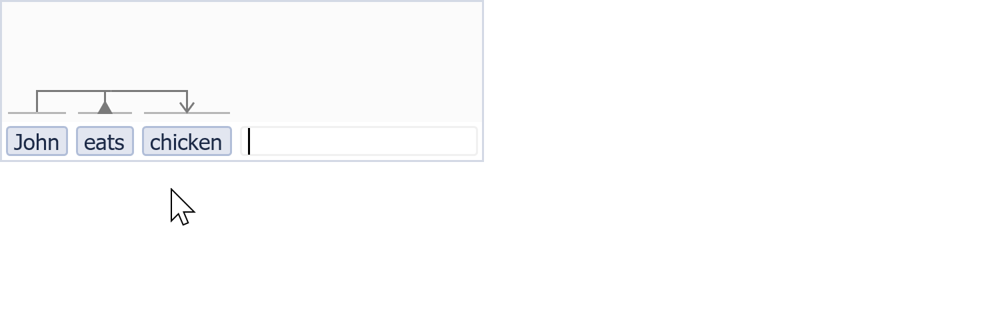
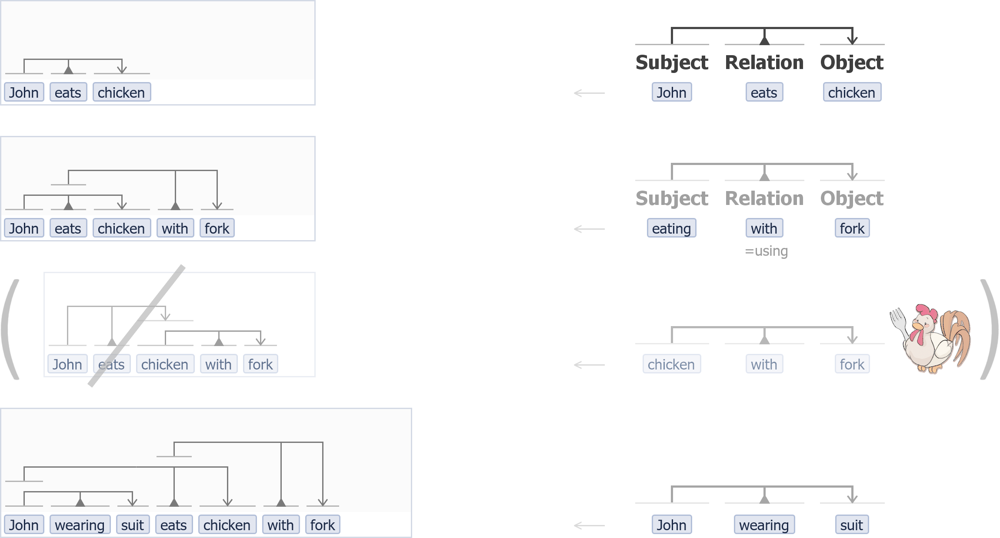
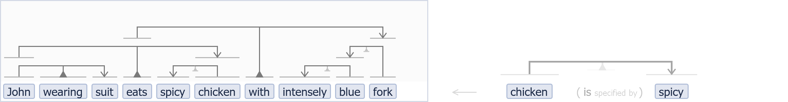
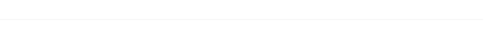
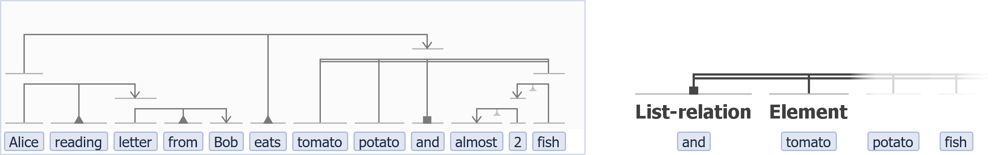
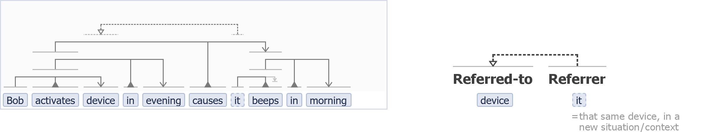
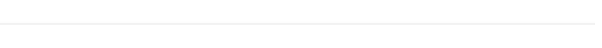
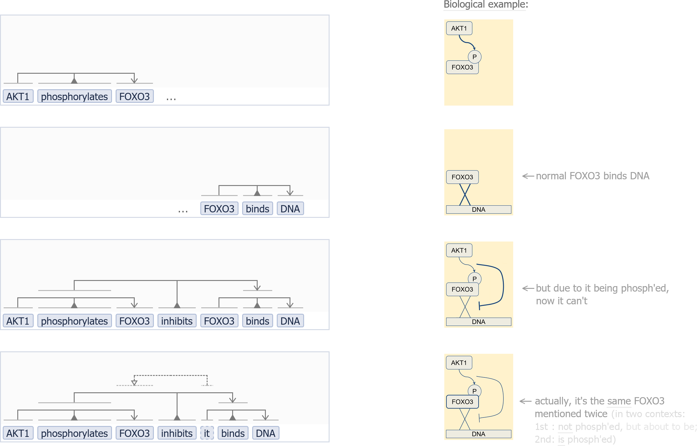
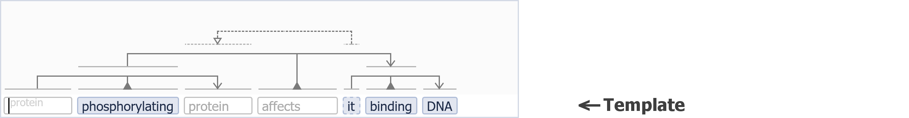
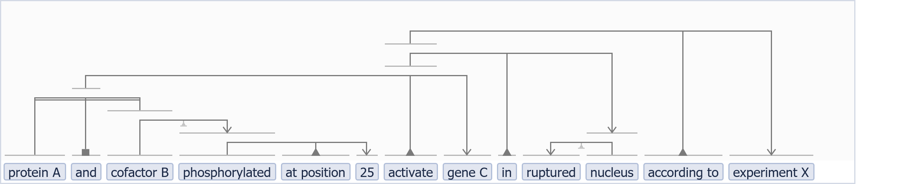

# vsm-box

<!-- badges: start -->

<!-- badges: end -->

## Intro

`vsm-box` is a web-component for entering or showing a VSM-sentence.

A **VSM-sentence** is a computer-understandable, natural-looking statement,
where each term is linked to an ID, and terms are organized with VSM-connectors.

**VSM** (Visual Syntax Method) is an intuitive method to translate any
knowledge, no matter its type or complexity, into an elegant form that is
understandable by both humans and computers. - A full description of this
general-purpose method for structuring information into a computable form,
is available on [scicura.org/vsm](http://scicura.org/vsm).

A **web-component** is something that can be shown in a web page by simply
inserting an HTML-tag, like a `<button>`, `<input>`, or here a `<vsm-box>`.

For web-developers who embed a vsm-box in a web-app, there are lots of
**customization** features to support the needs of various user groups.
For end-users who capture structured information, a vsm-box is an elegant
and powerful tool; and even more so when they can fill out VSM-templates.

See:
- a concise intro on [vsmjs.github.io](http://vsmjs.github.io),
  on how to use a vsm-box in your web-app;
- a larger introduction on this
  [poster](https://f1000research.com/posters/8-442);
- a [live vsm-box](http://scicura.org/vsm-box) to interact with;
- many explained [VSM examples](http://scicura.org/vsm/examples.html)
  (using an earlier vsm-box prototype);
- the examples below.

 

## Intro examples

This section shows:
- a vsm-box **animated example**  
  (what you see is: 1. entering two terms, 2.
  checking one term's definition (by mousehovering), 3. adding a connector
  that creates an unintended meaning ('chicken with fork') (+ see that
  connectors are automatically reordered for optimal layout), 4. removing
  it, 5. adding the second connector correctly) :

- several **vsm-box examples** (screenshots + information) :

 

 

## Documentation

See the [Documentation](Documentation.md) for full technical details on:

- VSM-sentence/term/connector **data-model** (and examples),
- VsmBox **props** (i.e. html-attributes),
- VsmBox **emitted events**,
- **user interaction**,
- **customized content** (for term labels, term popups, and autocomplete panel
  items),
- and more.

 

## Build

This project's configuration (webpack + npm + Vue + testing + linting) is as
described in
[github.com/stcruy/building-a-reusable-vue-web-component](https://github.com/stcruy/building-a-reusable-vue-web-component).  
This makes that `vsm-box` is built, or can be used as:
1)&nbsp;a standalone web-component, 2)&nbsp;a slim web-component,
and 3)&nbsp;a Vue component.

The latest version's built files are available at [unpkg](https://unpkg.com/browse/vsm-box/dist/):
- [vsm-box.standalone.min.js](https://unpkg.com/vsm-box/dist/vsm-box.standalone.min.js)
  &nbsp;(standalone;
  use it like [here](src/index-prod-standalone.html));
- [vsm-box.min.js](https://unpkg.com/vsm-box/dist/vsm-box.min.js)
  &nbsp;(slim, needs Vue etc. as external dependencies;
  use it like [here](src/index-prod-slim.html)).

 

## Contributing

Please read [CONTRIBUTING.md](CONTRIBUTING.md)
for details on our code of conduct, and the process for submitting pull requests.

 

## Created by

- **Steven Vercruysse** - *Main developer, VSM creator, project leader* -
  [stcruy](https://github.com/stcruy)
- Martin Kuiper - *Design feedback, VSM project guidance, outreach* -
  [makuintnu](https://github.com/makuintnu)
- John Zobolas - *Design suggestions* - [bblodfon](https://github.com/bblodfon)
- Vasundra Touré - *Design suggestions* - [vtoure](https://github.com/vtoure)
- Maria K. Andersen - *Design feedback* -
  [mariakarand](https://github.com/mariakarand)

 

## License

This project is licensed under the AGPL-3.0 license - see
[LICENSE.md](LICENSE.md).

The AGPL license protects your right to freely use the vsm-box
and other vsmjs modules. But if you modify the source code, the goal is
that you have to contribute those modifications back to the community.

Note* however that it is NOT required that applications be published
if, for entering and/or showing VSM-based information,
they use only unchanged, not-augmented vsmjs-modules.  
The copyleft applies only to the vsm-box and other vsmjs modules.
Your application, even though it talks to vsm-box, is a
separate program and "work".  
*_(That
is our interpretation and intention with AGPL, similar to how MongoDB does it.
If you know a legally better way to achieve this goal,
let us know.)_  

> _Why AGPL_  
> With VSM, we aim for unification of life science's efforts towards digital
> transformation of all its research findings. We want to promote
> community-building, and move forward with everyone together broadening the
> application set.  
> Because the vsm-box software directly reflects the core design of VSM, as a
> shareable semantic-data / knowledge format, we believe that modifications or
> enhancements to it must be made public as well. Otherwise a private actor could
> easily use an "embrace, extend, extinguish" approach to privatize an evolving
> technology that was originally meant to transform our scientific knowledge into
> a more open digital form.  
> We are inspired by the copyleft licensing that contributed to the success of
> Linux-based systems, for the same reason.
> We may revise this policy, if along the way we would learn that a most
> permissive license would give more benefit to society.
